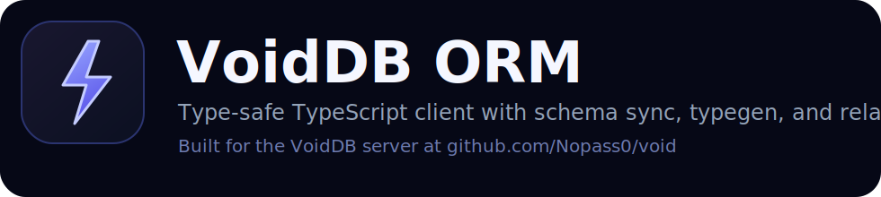

<p align="center">
  
</p>

<p align="center">
  <strong>Official TypeScript ORM for VoidDB.</strong><br>
  Typed CRUD, short CLI commands, `.schema` files, schema pull/push, migrations, and generated types in one package.
</p>

<p align="center">
  <a href="https://www.npmjs.com/package/@voiddb/orm">npm</a> |
  <a href="https://nopass0.github.io/void_ts/">Docs</a> |
  <a href="https://github.com/Nopass0/void">Core VoidDB Server</a> |
  <a href="https://nopass0.github.io/void/">Server Docs</a>
</p>

## Why use it

`@voiddb/orm` is built for the same workflow that makes Prisma productive:

- one command to scaffold local schema/config folders
- live schema pull and push from a running database
- short migration commands
- generated TypeScript types
- typed query builder with raw JSON export when you need it
- a client that can boot directly from environment variables

It stays close to the VoidDB HTTP API, so debugging stays simple.

## Install

```bash
npm install @voiddb/orm
```

or

```bash
bun add @voiddb/orm
```

## Quick start

```ts
import { VoidClient, query } from "@voiddb/orm";

type User = {
  _id: string;
  name: string;
  age: number;
  active: boolean;
};

const client = VoidClient.fromEnv();
await client.login(process.env.VOIDDB_USERNAME!, process.env.VOIDDB_PASSWORD!);

const users = client.db("app").collection<User>("users");

const id = await users.insert({
  name: "Alice",
  age: 30,
  active: true,
});

const rows = await users.find(
  query()
    .where("age", "gte", 18)
    .where("active", "eq", true)
    .orderBy("name")
    .limit(25)
);

console.log(query().where("active", "eq", true).json());

await users.patch(id, { age: 31 });
await users.delete(id);
```

## Zero-config project layout

Initialize a project once:

```bash
npx --package=@voiddb/orm vdb init
```

That creates:

```text
.env.example
.voiddb/
  config.json
  schema/
    app.schema
  generated/
    voiddb.generated.d.ts
    index.d.ts
    index.js
  migrations/
```

The CLI automatically reads:

- `.env`
- `.env.local`
- `.voiddb/.env`
- `.voiddb/config.json`

By default it expects:

- `VOIDDB_URL`
- `VOIDDB_TOKEN`
- `VOIDDB_USERNAME`
- `VOIDDB_PASSWORD`

## New `.schema` format

The default schema format is grouped by database:

```prisma
datasource db {
  provider = "voiddb"
  url      = env("VOIDDB_URL")
}

generator client {
  provider = "voiddb-client-js"
  output   = "../generated"
}

database {
  name = "app"

  model User {
    id String @id
    email String @unique
    name String
    createdAt DateTime @default(now())
    updatedAt DateTime @default(now()) @updatedAt
    @@map("users")
  }
}
```

Older top-level `model ...` syntax is still parsed for compatibility.

## Short CLI commands

After install, the short bin is `vdb`.

Local project:

```bash
npm install -D @voiddb/orm
npx vdb init
npx vdb pull
npx vdb push
npx vdb gen
npx vdb dev --name add_users
npx vdb status
npx vdb deploy
```

Without installing first:

```bash
npx --package=@voiddb/orm vdb init
npx --package=@voiddb/orm vdb pull
bunx --package @voiddb/orm vdb dev --name add_users
```

The long forms still work too:

```bash
npx --package=@voiddb/orm voiddb-orm schema pull
npx --package=@voiddb/orm voiddb-orm migrate status
```

## Pull, push, and migrate

With `.env` in the project root, commands no longer need repeated URL or auth flags:

```env
VOIDDB_URL=https://db.lowkey.su
VOIDDB_USERNAME=admin
VOIDDB_PASSWORD=your-password
```

Then:

```bash
npx vdb pull
npx vdb push
npx vdb dev --name add_status
npx vdb status
```

Type generation runs automatically after `pull`, `push`, `dev`, and `deploy` unless you pass `--no-generate`.

## Generated types

Generated declarations live in:

```text
.voiddb/generated/voiddb.generated.d.ts
.voiddb/generated/index.d.ts
```

So you can import from the folder instead of the generated filename:

```ts
import type {
  User,
  UserCreateInput,
  VoidDbGeneratedCollections,
  VoidDbGeneratedCollectionsByPath,
  VoidDbGeneratedDatabases,
} from "./.voiddb/generated";
```

Use the generated maps like this:

```ts
type ExactLowkeyUser = VoidDbGeneratedDatabases["lowkey"]["users"];
type AnyUsersCollection = VoidDbGeneratedCollections["users"];
type ExactPath = VoidDbGeneratedCollectionsByPath["lowkey/users"];

const users = client
  .database("lowkey")
  .collection<VoidDbGeneratedDatabases["lowkey"]["users"]>("users");
```

You can also regenerate explicitly:

```bash
npx vdb gen
```

## Query builder

```ts
const built = query()
  .where("age", "gte", 18)
  .orderBy("createdAt", "desc")
  .limit(10);

const rows = await users.find(built);
const rawQuery = built.json();
```

## Relation includes

```ts
const result = await client
  .db("app")
  .collection("users")
  .findWithRelations<{
    profile: { _id: string; bio: string };
  }>(
    query()
      .where("_id", "eq", "user-1")
      .include({
        as: "profile",
        relation: "many_to_one",
        target_col: "profiles",
        local_key: "profile_id",
        foreign_key: "_id",
      })
  );
```

## Cache API

```ts
await client.cache.set("session:alice", { loggedIn: true }, 3600);
const session = await client.cache.get<{ loggedIn: boolean }>("session:alice");
await client.cache.delete("session:alice");
```

## Links

- npm: [@voiddb/orm](https://www.npmjs.com/package/@voiddb/orm)
- ORM docs: [nopass0.github.io/void_ts](https://nopass0.github.io/void_ts/)
- Core server repo: [github.com/Nopass0/void](https://github.com/Nopass0/void)
- Core server docs: [nopass0.github.io/void](https://nopass0.github.io/void/)
- AI agent guide exposed by running servers: `https://<host>/skill.md`

## License

MIT
